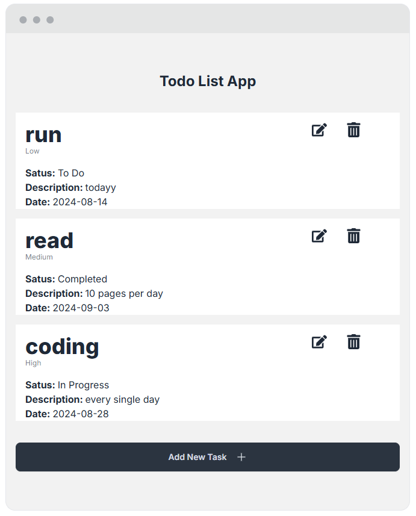
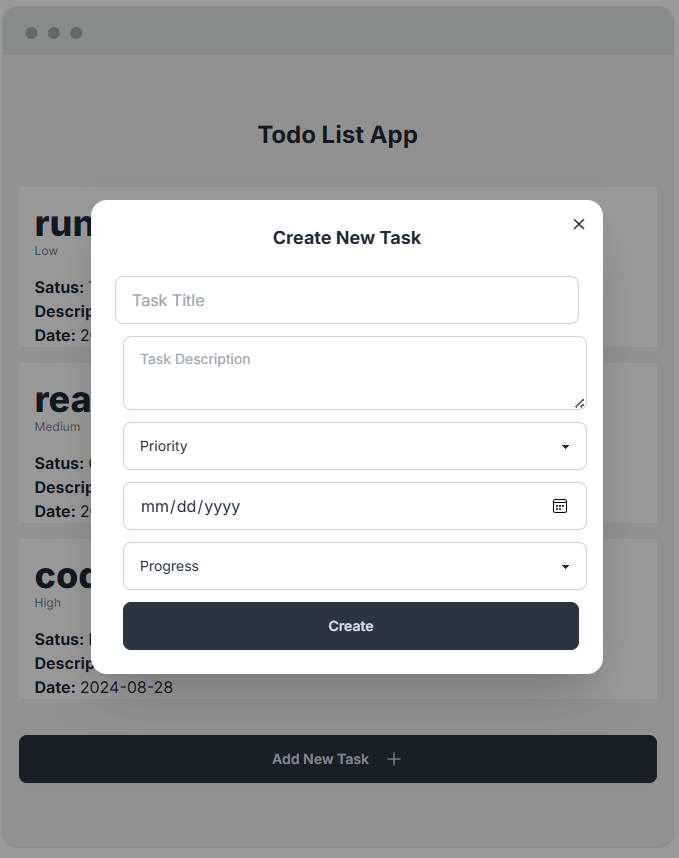
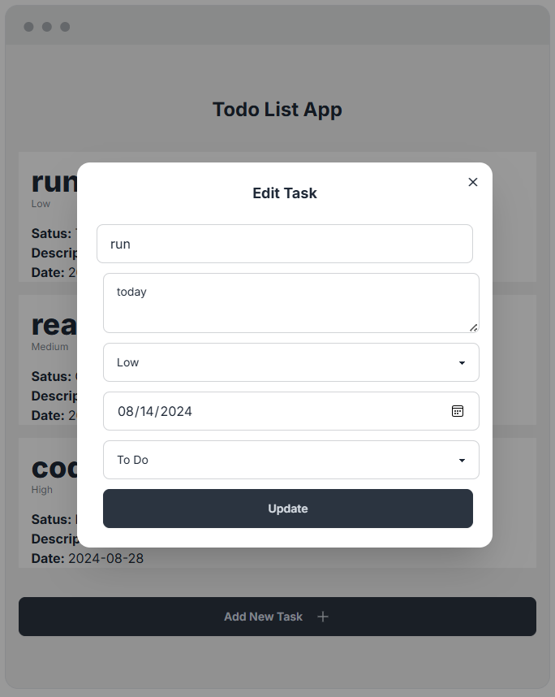
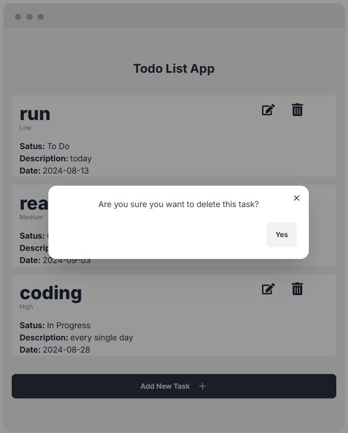

# To-Do App

## Project Overview

This is a full-stack To-Do application that allows users to manage their tasks efficiently. The application features a user-friendly interface built with **Next.js** on the front end, a robust backend powered by **Node.js** for handling API requests, and **MySQL** as the database for storing task data. The app also includes test coverage using **Jest** to ensure code quality and reliability.

## Table of Contents

- [Features](#features)
- [Technologies Used](#technologies-used)
- [Usage](#usage)
- [Challenges](#challenges)
- [Future Improvements](#future-improvements)
- [Screenshots](#screenshots)
- [Author](#author)

## Features

- **CRUD Functionality**: Create, Read, Update, and Delete tasks.
- **Responsive Design**: Adaptable layout for different screen sizes.
- **Real-Time Updates**: Tasks update asynchronously for a seamless experience.
- **Testing**: Comprehensive test suite using Jest for both backend and frontend.

## Technologies Used

- **Frontend**: Next.js, React 18, Tailwind CSS, DaisyUI
- **Backend**: Node.js, Express.js
- **Database**: MySQL
- **Testing**: Jest
- **Tools**: GitHub, Figma, Postman, AMPPS, VS Code, Click Up

## Usage

1. **Navigate to the versel URL (`https://to-do-list-gul7-1frzwofiq-katianaalmeidas-projects.vercel.app/`):**
   - You can now start adding, editing, and deleting tasks.

## Challenges

- Implementing real-time updates with asynchronous functions.
- Ensuring consistent styling across different devices using Tailwind CSS.
- Setting up and integrating Jest for comprehensive test coverage.

## Future Improvements

- **User Authentication**: Implement user login and task assignment.
- **Enhanced UI**: Add more customization options for task categories and priority levels.
- **Push Notifications**: Notify users about upcoming or overdue tasks.

### Screenshot

## Author

- Portfolio Website - [Katiana de Almeida](https://katiana-de-almeida.onrender.com/)
- Katiana Almeida - [Katianaalmeida48@gmail.com]
- Linkdlin - [KatianaDeAlmeida](https://www.linkedin.com/in/katiana-almeida-1731ba23a/)

